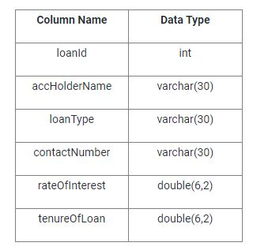
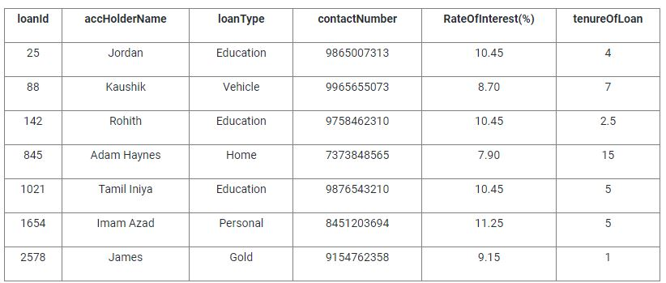

## Retrieve customer count based on loan type_JDBC

EasZee is one of the leading money lenders in the town. They want to automate a process in their system where the admin can have an access to view the number of customers who availed loan based on requested loan type.

You being their software consultant have been approached to develop an application which can be used for managing their service. You need to implement a Java program to view the count of customers.

#### Component Specification: Loan (Model Class)  
  
Note: Appropriate public getters,setters and a six argument constructor in the given order – loanId, Name, loanType,contactNumber, rateOfInterest,tenureOfLoan are provided as a part of the code template.

Requirement: Retrieve the count of customers based on the requested loan type

The admin should have an access to search and view the count of customers who have availed the loan under the requested loan type. Hence the system should fetch the count of customers who are in a particular loan type from the database and return the same.
#### Component Specification: LoanManagementSystem  
  

The loan table is already created at the backend. The structure of a loan table is as shown: 

  

Sample records available in the loan table are as shown below:  

  

To connect to the database you are provided with the database.properties file and the DB.java file. (Do not change any values in the database.properties file)

In the main class create a main method with the menu as described in the sample Input and Output.

When the admin selects the search again option ‘yes’ then he/she will be able to search the count of the customers who availed loan on a requested loan type till the program encounters ‘no’.

When the admin selects the search again option as ‘no’, display the message "Thank you for using the Application" and terminate the program.

Display the count of a loan as “Number of customers who have taken <LoanType> loan : <Count>” from the method viewLoansBasedOnType in the LoanManagementSystem class.

If no loan is available for the searched loan type, then the program should display “No customer has acquired <loanType> loan”.

#### Note:

In the Sample Input / Output provided, the highlighted text in bold corresponds to the input given by the user and the rest of the text represents the output.

Ensure to follow the object oriented specifications provided in the question description.
Ensure to provide the names for classes, attributes and methods as specified in the question description.

Adhere to the code template, if provided.

The following Sample Inputs / Outputs are generated based on the above mentioned Sample records given in the loan table.

#### Sample Input / Output 1:

Enter the type of loan to be searched

Education

Number of customers who have taken Eduaction loan : 3

Do you want to searched again the loan type (yes/no)

yes

Enter the type of loan to be searched

Home

Number of customers who have taken Home loan : 1

Do you want to searched again the loan type (yes/no)

no

Thank you for using the Application

#### Sample Input / Output 2:

Enter the type of loan to be searched

Agricultural

No customer has acquired Agricultural loan

Do you want to searched again the loan type (yes/no)

no

Thank you for using the Application

