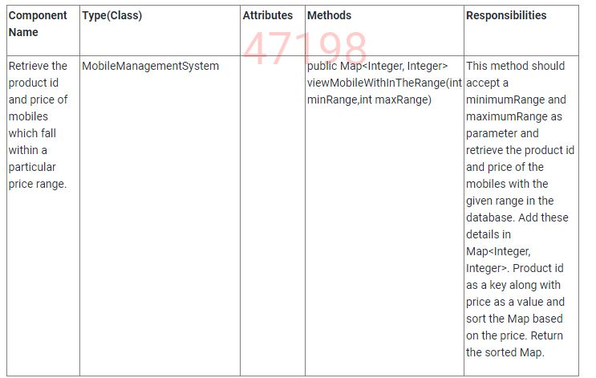

## Retrieve ID and Price of mobiles with in the range_JDBC

Hy Fy mobiles is a famous mobile showroom in the city. The detail of every mobile in their showroom is available in their database. The showroom wants to give the customers the facility to view the product id and the price of mobiles that falls within a particular price range.

You being their software consultant have been approached to develop an application which can be used for managing their business. You need to implement a Java program to view the product id and the price of all the mobiles based on the range.

#### Component Specification: Mobile(Model Class)  

  

**Note:** Appropriate public getters,setters and a six argument constructor in the given order – **productId, brandName, modelName, memory,price,colour** are provided as a part of the code template.

**Requirement 1:** Retrieve the product id and the price of mobiles within the given price range

The customer should have the facility to view the product id and price of mobiles which falls within a particular price range. Hence the system should fetch the product id and price of all the mobiles for the given range from the database. The product id and the price of those mobiles should be added to a Map<Integer, Integer>. Product id as a key along with price as a value. Sort the Map based on the price and return the same.

**Component Specification:MobileManagementSystem**  
  

**Note**: The class and methods should be declared as public and all the attributes should be declared as private.
The **mobile** table is already created at the backend. The structure of the mobile table is as follows:
  
Sample records available in the mobile table are as shown below:  

  

o connect to the database you are provided with the **database.properties** file and the **DB.java** file.(Do not change any values in the database.properties file)

Create a class called Main with the main method and get the inputs like minimumvalue and maximumvalue from the user.

Display the productId and price for all the mobiles returned as Map<Integer, Integer> from the method **viewMobileWithInTheRange** in the **MobileManagementSystem** class.

If no mobile is available in the list, the output should be “**No mobiles found for the given range**”.

**Note**:

In the Sample Input / Output provided, the highlighted text in bold corresponds to the input given by the user and the rest of the text represents the output.

Ensure to follow the object oriented specifications provided in the question description.
Ensure to provide the names for classes, attributes and methods as specified in the question.

The following Sample Inputs / Outputs are generated based on the above mentioned Sample records given in the mobile table.

Adhere to the code template, if provided.
Assume that the value of the minimum range is always less than the value of the maximum range.

**Sample Input / Output 1:**

Enter the minimum range

5000

Enter the maximum range

20000

146:5999

104:11999

**Sample Input / Output 2:**

Enter the minimum range

65000

Enter the maximum range

75000

No mobiles found for the given range

