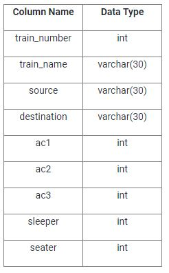

##Search for Trains - JDBC

Indian Railways Department wants to automate a process in their system. The train details are available in the database. The user should have a facility to search and view the trains based on a particular coach type available in the train which starts from a particular source place and ends in a particular destination place. A train can have various coach types among AC1, AC2, AC3, Sleeper and Seater.

You being their software consultant have been approached by them to develop an application which can be used for managing their business. You need to implement a Java program to view all the train which runs between a source and a destination with a particular coach type. Display the trains in a sorted order based on train number.

**Component Specification: Train (Model Class)**  
 
**Note**: Appropriate public getters,setters and a nine argument constructor in the given order – trainNumber, trainName, source,destination, ac1,ac2,ac3,sleeper,seater are provided as a part of the code template.

**Requirement**: Retrieve all the trains between source and destination with the required coach type

The user should have a facility to search and view the trains which runs between a source and a destination with a particular coach type. Hence the system should fetch all the train details for the given source and destination which contains the given coach type, from the database.

There can be more than one train which suits for the given requirement. So, the train details should be retrieved in a sorted order based on train number. Add all those train details into an ArrayList and return the same.

**Component Specification: TrainManagementSystem**  
 
The train table is already created at the backend. The structure of train table is: 

 

Sample records available in train table are: 

 

To connect to the database you are provided with database.properties file and DB.java file. (Do not change any values in database.properties file)

Create a class called Main with the main method and get the inputs like source, destination and coachType from the user. The coachType should be any one among AC1, AC2, AC3, Sleeper and Seater (Case In-sensitive). If coachType is valid, then call viewTrain method in TrainManagementSystem class. Otherwise, display the output as “Invalid Coach Type”.

Display the details of train such as trainNumber and trainName for all the trains returned as ArrayList<Train> from the method viewTrain in TrainManagementSystem class.

If no train is available as per the requirement, the output should be “No trains found”.

**Note:**

·         In the Sample Input / Output provided, the highlighted text in bold corresponds to the input given by the user and the remaining text represents the output.

·         Ensure to follow object oriented specifications provided in the question description.
Ensure to provide the names for classes, attributes and methods as specified in the question description.

·         Adhere to the code template, if provided.

·         In database, the coach type of train is given as separate columns. This represents the number of respective coaches available in the train.

·         The following Sample Inputs / Outputs are generated based on the above mentioned Sample records given in train table.

**Sample Input / Output 1:**

Enter the source

Howrah

Enter the destination

Dehradun

Enter the coach type

AC2

13009  Doon Express

**Sample Input / Output 2:**

Enter the source

Mumbai

Enter the destination

Pune

Enter the coach type

Sleeper

12123  Deccan Queen

22119  Pune Express

**Sample Input / Output 3:**

Enter the source

Okha

Enter the destination

Guwahati

Enter the coach type

AC

Invalid Coach Type

**Sample Input / Output 4:**

Enter the source

Okha

Enter the destination

Guwahati

Enter the coach type

AC1

No trains found

